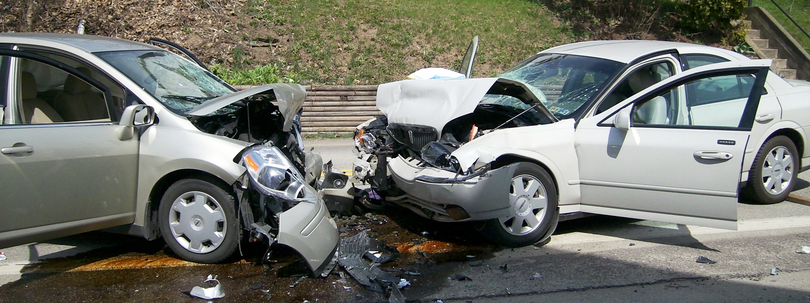
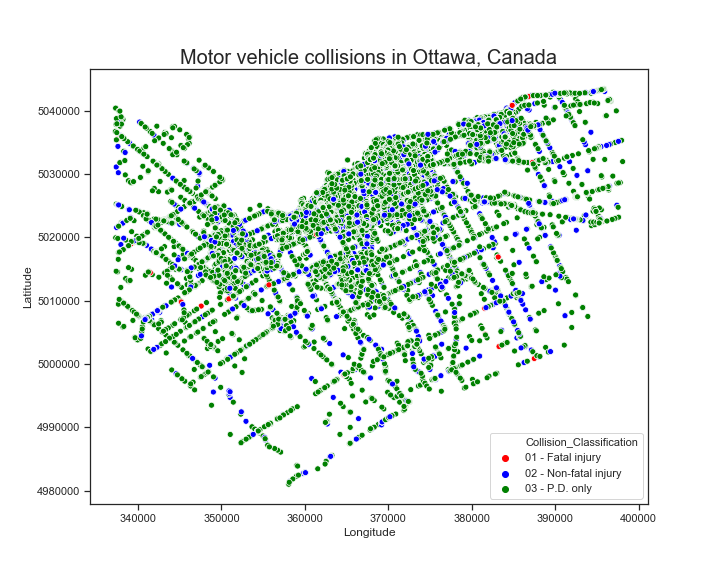

# Ottawa Motor Vehicle Collisions (2014 - 2017)

# Overview
In real-world datasets, class imbalance is a common problem. An imbalanced dataset occurs when one class (called the majority, or negative class) vastly outnumbered the other (called the minority, or positive class). The class imbalance problem is manifested when the positive class is the class of interest. We have obtained a real-world dataset of motor vehicle collisions with an inherent imbalanced class problem.

##  Dataset info:   [Open Data Ottawa](http://data.ottawa.ca/en/organization/transportationservices)

##  Project objectives
The main objective of this project is to build a machine learning predictive model that would predict fatal and non-fatal collisions. There are three distinct classes and they are highly imbalanced as shown below.

For learning purposes, we build a binary Classifier by reducing the 3-class problem as a binary-class problem. To do this, we consider the class variable "Fatal injury" as one class, whereas the class variable "Non-fatal injury" and  "Property damage (P.D.) only" are considered  as a joint class,  representing the effective "Non-fatal injury class". The resulting binary-class problem is a highly imbalanced dataset, with the  Fatal injury as the minority (positive) class consisting of only 0.2% of the dataset.

##  Practice skills
In this project, we implemented the following  skills

- Data cleaning

- Exploratory Data Analysis

- Imbalanced learning & Cost sensitive method

- Under Sampling

- Synthetic Minority Over Sampling Technique (SMOTE)

-  Advanced classification models such as random forest classifier and XGBoost

- Precision Recall  (PR) Curve and Area Under the PR Curve (AUPR)

- Receiver Operating Characteristics (ROC) curve and Area Under the ROC (AUROC)
